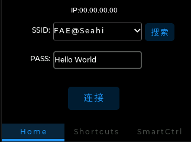
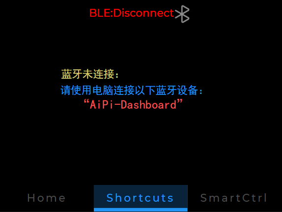
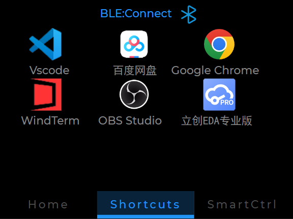
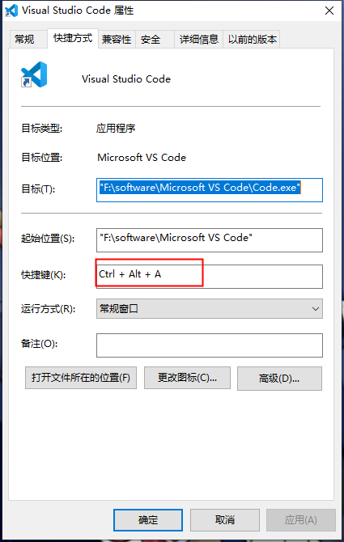
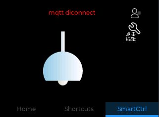
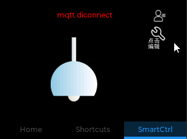
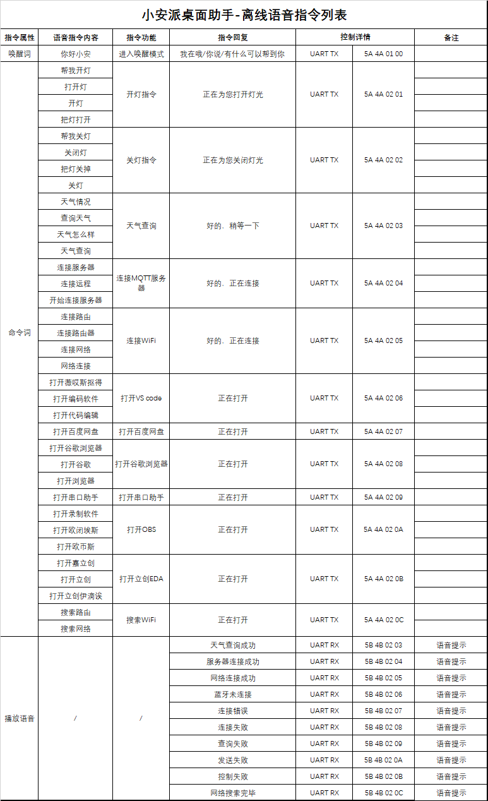

# 小安派桌面助手

## 概述
 
应粉丝需求，想要在天气站上加入电脑互动+离线语音+智能家居控制的功能，工程师掉了半个月的头发，终于面世了。


本次桌面助手项目已经实现了天气+时间查看、离线语音及部分语音提示、电脑软件快捷方式、MQTT远程控制功能。而且还加入设计了外壳，相比之前的天气站，现在相当美观了。


## 文件介绍

```
├── 3D_stl ——3D外壳文件
├── AiPi-DSL_Dashboard_code ——小安派桌面助手源码
├── Ai-WB2_SmarLight ——受控智能灯源码
├── IMG ——图片文件夹
├── README.md —— 说明文档
├── software ——固件集成
└── VC_code ——VC 离线语音源码
```

## 使用说明

### 1、配置WiFi 连接

在`Home`页面，下滑会进入WiFi配置页，点击`搜索`按钮会开始搜索附近可用的SSID，默认可选10个信号最强的WiFi。选择好WiFi之后，即可输入WiFi 密码。点击`连接`按钮就能触发WiFi连接。



### 2、快捷助手使用

#### 1）连接蓝牙

电脑未连接**桌面助手**时，会提示连接：



电脑使用蓝牙连接名称为 **“AiPi-Dashboard”** 的蓝牙键盘设备，连接成功后，界面会变成：



#### 2）快捷使用

桌面助手的快捷方式软件已经固化，不能动态配置需要显示的软件的图标，值得一提的是，快捷方式的原理是模拟键盘按下快捷键来打开电脑上的软件，这6个快捷方式的快捷键为：

| 软件|快捷键|
| :----: |:----: |
|   Vscode |Ctrl+Alt+A|
|   百度网盘 |Ctrl+Alt+B|
|   Google Chrome |Ctrl+Alt+C|
|   WindTrem |Ctrl+Alt+D|
|   OBS Studio |Ctrl+Alt+E|
|   立创EDA专业版 |Ctrl+Alt+F|

可以设置电脑上的任意软件以这6个快捷键的其中一个，可以是实现快捷打开，比如：



完成这个设置之后，你就可以桌面助手打开电脑的任意软件。

### 3、连接MQTT 服务器

远程控制方式是通过MQTT来实现，桌面助手会作为客户端接入MQTT服务器，以向服务器发送消息的方式来控制订阅了该消息客户端。本项目中，所使用的MQTT服务器是 **“EMQX”** 的公共服务器（https://www.emqx.com/zh/mqtt/public-mqtt5-broker）， 当然服务器是可以动态配置的，在`SmartCtrl`控制界面里，可以通过配置客户端信息来实现配置服务器的HOST：



这里没有提供**ClientID**的配置，因为界面实在不想弄得太大。默认的**ClientID="AiPi-DSL_Dashboard"**,当然你也可以在代码当中修改它。除此之外，发送消息的Topic和内容也可以自由的配置，只需要点击编辑按钮：



最后，你可以点击`挂灯`来给MQTT服务器发送指令。

### 4、语音指令
离线语音是使用**VC-01**来实现的，它可以让你释放双手做到连接服务器、控制灯甚至是打开电脑软件等操作。利用VC-01桌面助手能够有一些简单的语音提示，比如`网络成功`、`天气查询成功`等。
