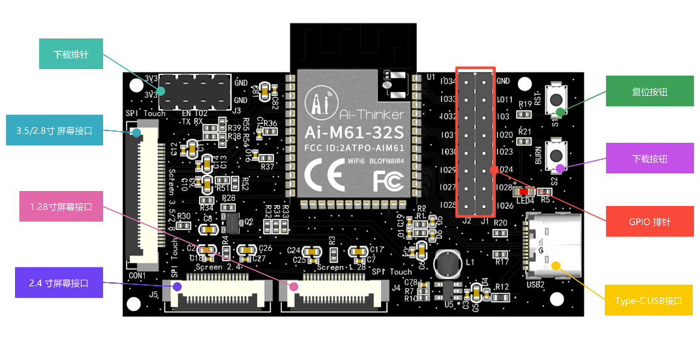
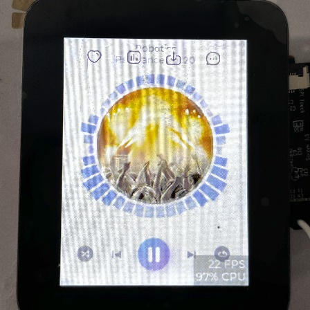
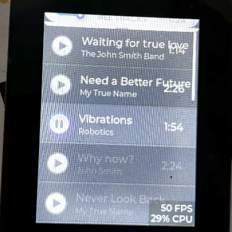
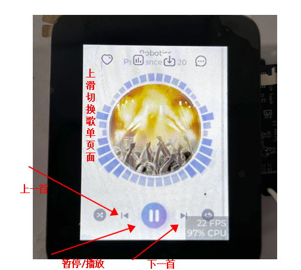
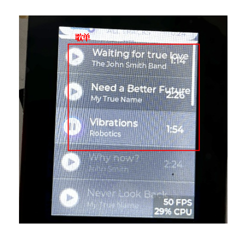

# 小安派-DSL 2.4寸屏音乐播放器

## 概述

小安派-DSL（AiPi-DSL） 是安信可开源团队专门为Ai-M61-32S设计的一款屏幕驱动开发板，支持2.8/3.5寸等30Pin SPI显示屏、2.4寸及1.28寸等18Pin SPI显示屏。
本工程即在2.4寸显示屏上实现音乐播放器的界面。



## 使用说明

音乐播放器Demo 一共有两个界面：主页和歌单页面。主页主要显示歌手的头像及音乐跳动动画及基础的音乐控制按钮，歌单页面主要显示所有歌曲的名字。



## 主页操作

上滑可切换到歌单页面

 

 ## 歌单页面

 下拉界面可以切换到主页，点击歌单可以在主页播放。



## 克隆编译

```
git clone --recurse-submodules https://github.com/Ai-Thinker-Open/AiPi-DSL_MusicPlay.git
cd aithiner_Ai-M6X_SDK
. export.sh
cd ..
make
```

## 烧录下载

```
make flash COMX=/dev/ttyUSB0 

```