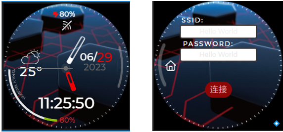
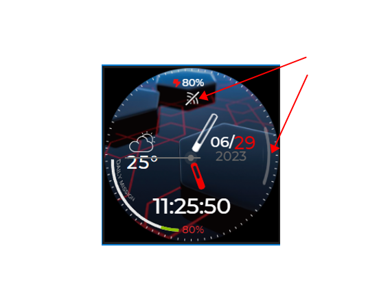
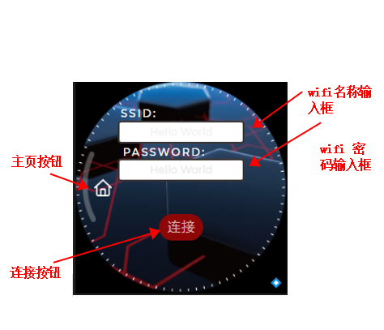

# 小安派-DSL 1.28寸圆屏手表Demo


## 一、概述

小安派-DSL（AiPi-DSL） 是安信可开源团队专门为Ai-M61-32S设计的一款屏幕驱动开发板，支持2.8/3.5寸等30Pin SPI显示屏、2.4寸及1.28寸等18Pin SPI显示屏。
本工程即在1.28寸圆形显示屏上实现智能手表的功能，可以实现网络时间更新。

## 二、使用说明

圆形手表Demo 一共有两个界面：主页和配置页面。主页主要显示时间等信息，配置页面用于WiFi 网络配置.



### 操作说明

- **主页**
点击最右边的位置或者点击`WiFi`图片即可进入配置界面。



- **配置界面**
`SSID` 输入框用于输入WiFi 名称，`PASSWORD`输入框用于输入WiFi密码，输入完成之后点击`连接` 按钮即可触发WiFi 连接。连接成功之后会自动切换到**主页**，也可以点击`主页`按钮切换到**主页**。



## 三、克隆编译

- **克隆**
```
git clone https://github.com/Ai-Thinker-Open/AiPi-DSL_Watch.git
git submodule init 
git submodule update
```

- **编译**

```
cd aithinker_Ai-M6X_SDK
. install.sh 
. export.sh
cd ..
make
```
## 四、下载烧录

```
make flash COMX=/dev/ttyUSB0 
```