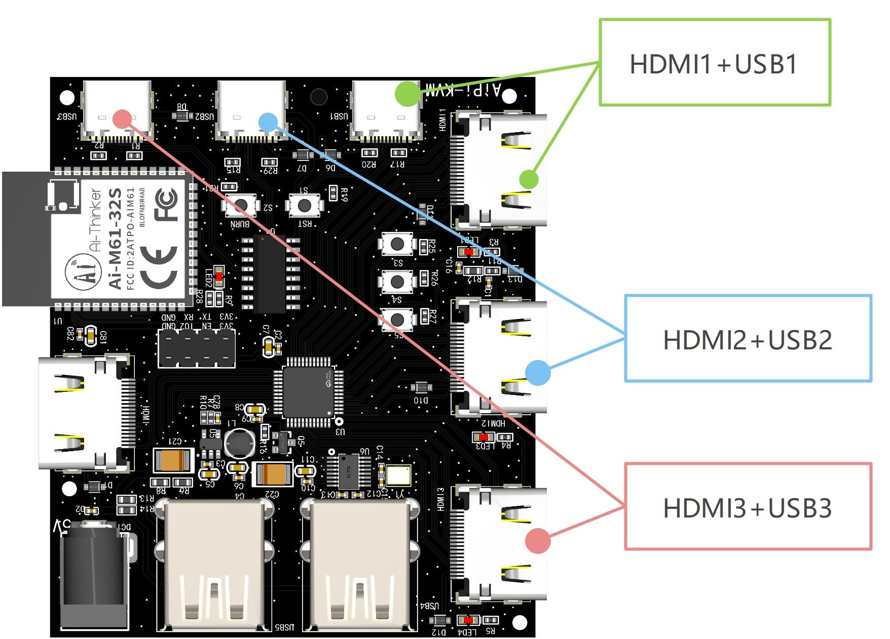
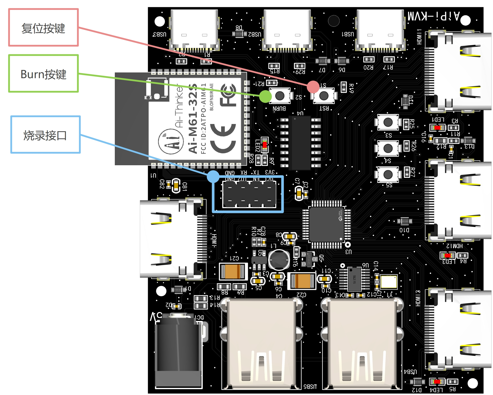

# AiPi-KVM 三进一出切换器

## 概述

<font size=4>

AiPi-KVM 是一款三进一出的HDMI+USB的切换器，可以让一个显示器在三台主机中切换其中一台主机，同时会把KVM上的USB设备（键盘鼠标等）也切换到目标主机当中。
这个设备方便开发人员在只有一台显示器且有3台电脑主机的情况下使用。


目前，这个源码只实现了使用按键进行切换主机，M61模组支持WiFi+BLE，所以它能够开发出更多的远程切换方式，比如可以通过在**AiPi-DSL_Dashboard** 工程添加一个控制页面，并开启一个TCP服务器，**AiPI-KVM**开发一个TCP客户端功能连接上**AiPi-DSL_Dashboard** 之后就能实现快捷控制。
</font>

## 使用方法

### 1.连接

<font size=4>

> **AiPi-KVM 需要额外接入供电口，因为USB和HDMI的5V足以为整个板子供电**

AiPi-KVM 拥有众多接口，而其中有三组输入: HDMI1+USB1、HDMI2+USB2、HDMI3+USB3,它们每组是成对接入同一台主机。所以你需要准备一根HDMI线和Type-C USB数据线。



除此之外，HDMI的输出和键盘鼠标的接入可以参考[概述](#概述)中的示意图。

</font>

### 2.切换

<font size=4>
板载的三个轻触按键，分别对应了三个主机的选择：

| 按键序号 | HDMI通道 | USB通道| 
| :----: | :----: |:----: |
| S3|HDMI1|USB1|
| S4|HDMI2|USB2|
| S5|HDMI3|USB3|

例如，当按下S3时，HDMI的输出及键盘鼠标会同时切换到第一台主机上，屏幕显示第一台主机的页面。
</font>

### 3.掉电储存

<font size=4>
AiPi-KVM 可以存储当前设置的通道，所以当AiPi-KVM 重新启动时，可以自动设置掉电前的最后的通道。
</font>

### 4.一些想法

<font size=4>

AiPi-KVM 使用Ai-M61-32S做切换控制，WiFi6+BLE5.3拥有强大的无线传输能力，所以它能够实现无线的控制，你可以用它连接之前**AiPi-DSL_Dashboard** ，或者使用App控制切换，这样，你就可以给它设计一个外壳，不需要按键就能做到切换PC。

</font>

## 编译和烧录

### 1.烧录接线



<font size=4>

AiPi-KVM 设计紧凑，因此没有把TTL芯片电路设计进去，因此，需要使用TTL工具连接烧录接口：

| 烧录接口 |  TTL工具 | 
| :----: | :----: |
| 3V3| 3.3V|
|RX|TXD|
|TX|RXD|
|GND|GND|

</font>

### 2.编译烧录

<font size=4>

```
make 
make flash COMX=xxx
```

> COMX=xxx 中的xxx时PC中实际的USB端口号
> 在Linux中通常是：/dev/ttyUSBx
> 在Windows中通常是：COMx
> 指令发送完成之后根据提示按 **复位按键**
</font>

### 3.运行log

<font size=4>

**LOG 波特率：2000000**
</font>

```shell
 ____               __  __      _       _       _     
 |  _ \             / _|/ _|    | |     | |     | |    
 | |_) | ___  _   _| |_| |_ __ _| | ___ | | __ _| |__  
 |  _ < / _ \| | | |  _|  _/ _` | |/ _ \| |/ _` | '_ \ 
 | |_) | (_) | |_| | | | || (_| | | (_) | | (_| | |_) |
 |____/ \___/ \__,_|_| |_| \__,_|_|\___/|_|\__,_|_.__/ 

Build:09:17:27,Sep  4 2023
Copyright (c) 2022 Bouffalolab team
=========== flash cfg ==============
jedec id   0xC84017
mid            0xC8
iomode         0x04
clk delay      0x01
clk invert     0x01
read reg cmd0  0x05
read reg cmd1  0x35
write reg cmd0 0x01
write reg cmd1 0x31
qe write len   0x01
cread support  0x01
cread code     0x20
burst wrap cmd 0x77
=====================================
dynamic memory init success, ocram heap size = 261 Kbyte 
sig1:ffffffff
sig2:0000f32f
cgen1:9f7ffffd
Active Partition[0] consumed 596 Bytes
======= PtTable_Config @0x62fcb498=======
magicCode 0x54504642; version 0x0000; entryCnt 8; age 0; crc32 0xE38928F3
idx  type device active_index     name   Address[0]  Address[1]  Length[0]   Length[1]   age
[00]  16     0         0        Boot2  0x00000000  0x00000000  0x0000e000  0x00000000  0
[01]  00     0         0           FW  0x00010000  0x00210000  0x00200000  0x00168000  0
[02]  10     0         0          mfg  0x00210000  0x00000000  0x00168000  0x00000000  0
[03]  02     0         0        media  0x00378000  0x00000000  0x00071000  0x00000000  0
[04]  03     0         0          PSM  0x003e9000  0x00000000  0x00008000  0x00000000  0
[05]  04     0         0          KEY  0x003f1000  0x00000000  0x00002000  0x00000000  0
[06]  05     0         0         DATA  0x003f3000  0x00000000  0x00005000  0x00000000  0
[07]  06     0         0      factory  0x003f8000  0x00000000  0x00008000  0x00000000  0
[MTD] >>>>>> Hanlde info Dump >>>>>>
      name PSM
      id 0
      offset 0x003e9000(4100096)
      size 0x00008000(32Kbytes)
      xip_addr 0xa03d8000
[MTD] <<<<<< Hanlde info End <<<<<<
ENV AREA SIZE 32768, SECTOR NUM 8
*default_env_size = 0x00000001
[I:     26167][kvm_dev.c:109]   KVM_DEV> KVM start read kvm channel:KVM_HDMI_CH1
[I:     26726][kvm_dev.c:169]   KVM_DEV> KVM redy set ch1
addr@0xa002f778 is xip flash, size 6
[I:    239013][kvm_dev.c:126]   KVM_DEV> KVM redy set USB ch1
[F:    439724][main.c:37]      MAIN> [MAIN:37]heap_size------->KMEM_HEAP=258248  PMEM_HEAP=258248
....
```

