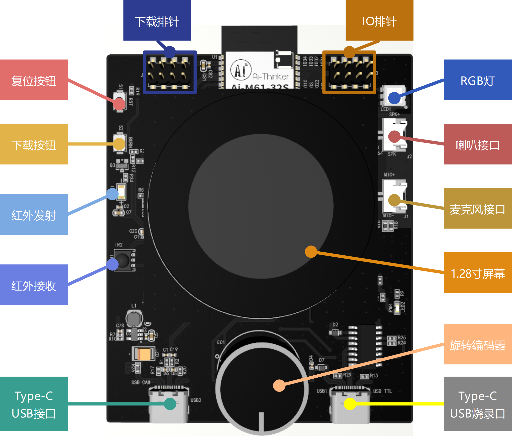

# AiPi-Knob-ClipsTool 剪辑助手

## 概述

AiPi-Knob-ClipsTool 剪辑助手是一个HID键盘设备， 拥有蓝牙的电脑可以识别到它，并且与其连接。
它只有一个功能，就是控制视频剪辑软件的时间轴，方便视频剪辑人员可以对时间轴进行帧的调整。
`AiPi-Knob-ClipsTool` 的是运行在**AiPi-Knob**智能旋钮之上，因此，在控制时间轴的时候，直接使用旋钮进行控制。

## 使用方法

### 1.连接 AiPi-Knob-ClipsTool

**AiPi-Knob-ClipsTool**设计了两个常用软件视频的界面，但是它没有连接任何电脑时，它不会显示任何界面，只会显示提示信息：

这时，需要使用电脑的蓝牙搜索并连接**AiPi-Knob**屏幕显示的`AiPi-CilpsTool`名称的蓝牙设备，当连接成功之后，**AiPi-Knob-ClipsTool**就会显示软件名称，默认会显示**Pr**.

### 2.时间轴控制

当**AiPi-Knob-ClipsTool** 连接上电脑之后，可以点击旋钮进入对应软件的控制界面。随之在电脑上打开视频剪辑软件并打开项目，选中时间轴之后，**顺时针转动**旋钮可以让时间轴**前进**，**逆时针**转动控制时间轴的**后退**。**长按3s**可以退出控制页面，旋钮的控制功能会切换成**AiPi-Knob-ClipsTool**页面切换。

## 编译与烧录
