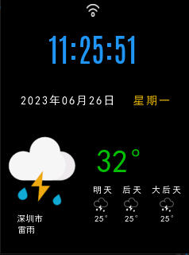
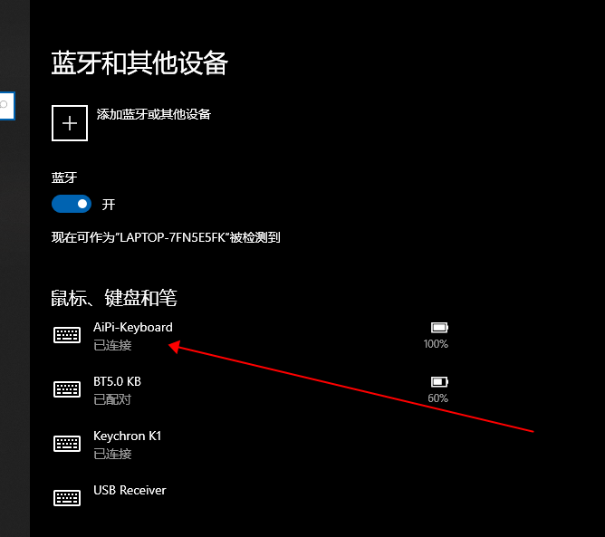
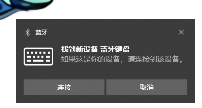
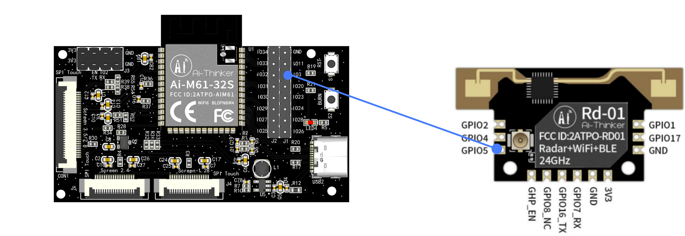

# 雷达天气站

是的，我们又开发了一个看起来没什么用，实际上也没什么用的天气站。它长这样：

但是它还是有点用的，因为这次我们加了Rd-01 雷达模组。所以叫它雷达天气站，还加了USB的功能，通过USB连接电脑，可以控制电脑的亮度。

## 一、功能描述

*雷达天气站* 适合摆放在电脑显示器旁边，内置的雷达不能识别太远的距离（大概在0.7米~1米左右），这个距离让它能识别你到底在不在电脑座位上。
从而控制已经连接的笔记本显示器的亮度。

通过雷达的识别，天气站会得知电脑前面是否有人，当某个时间无人后，会把显示器的亮度调节到最低（通过USB或者BLE），降低功耗。
当你忙完某件事后，再次回到电脑座位上，它会恢复电脑显示器的亮度。
这个功能看似比较鸡肋，但是把雷达应用在控制家里的照明灯，那就不一样了。

### 1.1 界面介绍

| 主界面| WiFi配置界面| 雷达和USB配置界面 |
| :----: |:----: |:----: |
||||
| 时间、天气等信息 | 用于配置WiFi STA的连接信息| 用来配置于电脑的连接方式和雷达无人检测的灭屏时间 |

### 1.2 雷达检测配置

雷达检测配置界面只有两个配置选项：下拉框和输入框

 - 下拉框：下拉框可选只有两个选项：
    - USB: 连接电脑采用USB方式连接，这时候需要使用Type-C 数据线接入电脑中。
    - BLE:使用BLE 协议连接电脑，选中之后，电脑弹窗出连接选项。 
>连接成功电脑之后，能够在电脑的设备管理器中看到它。
>
> 

 - 输入框：输入框是雷达在识别无人后延迟的时间，超出这个时间才会把电脑显示器的屏幕亮度降到最低。

## 二、使用说明

### 2.1 WiFi 配置连接

- 下滑进入WiFi 配置界面
- 点击 `搜索`按钮开始扫描周围AP
- 下拉选择需要连接的SSID 
- 在输入框中输入正确的密码
- 点击`确定`按钮，发起连接

### 2.2 雷达配置
 
 - 下拉框选择与电脑的连接方式，USB 需要使用Type-C USB连接，BLE 需要电脑支持BLE设备
 - 输入框输入相应的延迟时间，默认5s

### 2.3 蓝牙连接

启动蓝牙之后，电脑会自动有弹窗，提示连接，这时候只需要点击`连接`即可连接天气站

### 2.4 Rd-01 雷达模组配置

本工程需要对雷达模组做基本配置，需要烧录特定的固件才能有准确的识别，固件在**Rd-01 fw/Rd01_IO5.bin**,

烧录过程请参考：https://aithinker.blog.csdn.net/article/details/125781602

接线请参考：https://blog.csdn.net/Boantong_/article/details/130235376

#### 配置参数如下：

 - **运动探测最远距离门：1**
 - **静止探测最远距离门：1**
 - **无人持续时间：1**
 - **灵敏度：**
   - **运动目标：50**
   - **静止目标：50**

配置完成之后，把Rd-01 的**IO5** 连接到AiPi-DSL 的**IO3**

当然，3V3和GND也要连接。

## 三、其他说明

### 3.1程序错误

天气站长时间会出现程序错误，但是我们还没有找到原因，目前也是在努力测试当中

### 3.2 外壳文件

外壳文件在 `stl`文件夹当中，可以直接使用打印。

