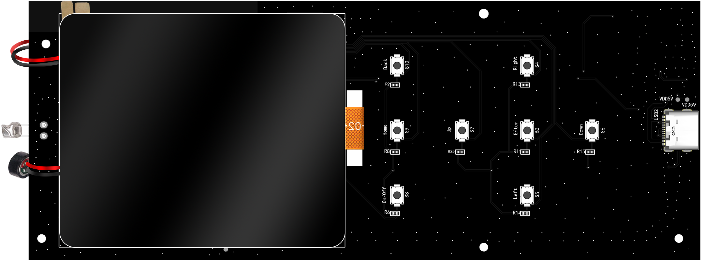
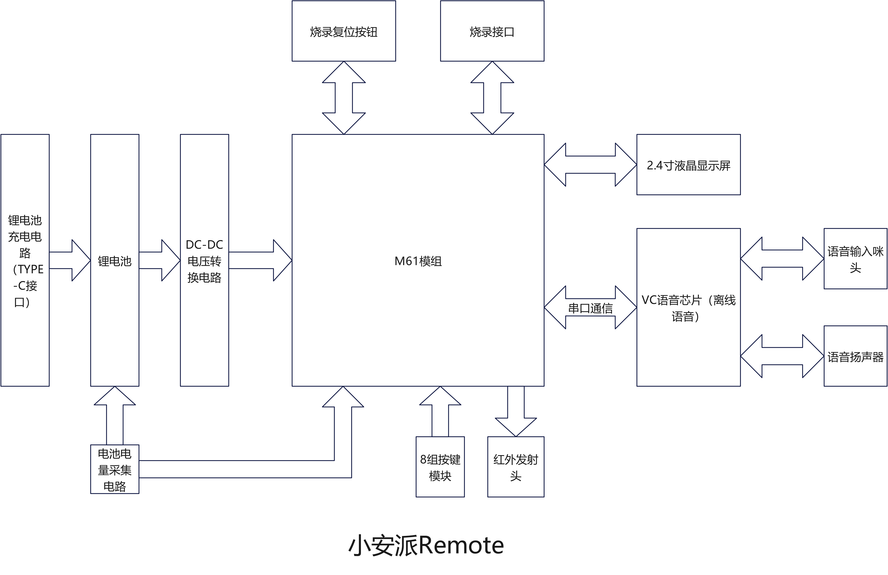
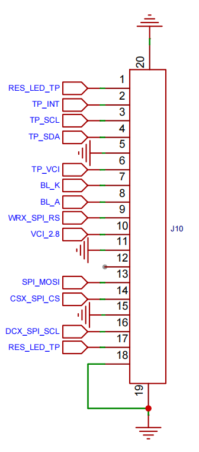
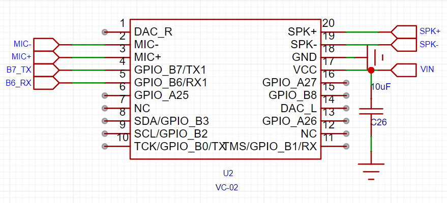
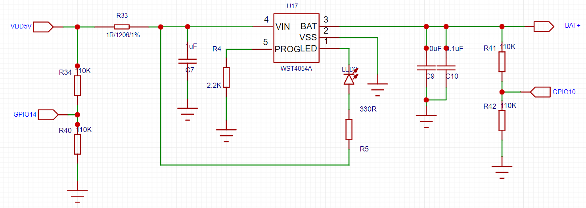
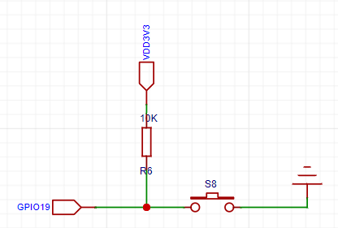

# 小安派-Remote
>
>├── AiPi-Remote_code ————>小安派源码
>├── doc              ————>使用说明文档
>├── IMG              ————>图片       
>└── VC-02_code       ————>VC-02离线语音源码
>

## 概述

小安派-Remote具有2.4寸液晶显示模块、电池电量检测模块、离线语音模块、红外发射模块、8个按键组合模块、锂电池充电模块、DC-DC电压转换模块。
小安派-Remote 具有 2.4 寸液晶显示模块、电池电量检测模块、离线语音模块、 红外发射模块、8 个按键组合模块、锂电池充电模块、DC-DC 电压转换模块。
小安派-Remote 出厂固件对美的空调做了红外适配，可以通过按键、触摸屏及离线语音控制空调。 
采用安信可M61无线模组为控制核心，通过M61芯片驱动2.4寸液晶屏，每个按键都有独立的IO输入口，离线语音通过串口与M61进行数据通信，电池电量通过ADC进行电压采样检测。

## 系统框图

## 2.4寸触控液晶显示屏

2.4寸屏接口，使用的也是显示屏+触摸屏一体的FPC 排线，但是它使用的18Pin 的接口。

## VC语音芯片

VC-02离线语音模块，使用5V供电，通过串口与M61模组进行通讯，外接出喇叭和咪头。

## 红外发射头

配备红外发射模块，发射红外信号对设备进行控制。

## 充电电路

使用USB接口给电池充电。

## 8个独立按键

配备了8个独立按键，这里不一一展示。

## 离线语音列表

| 语音指令 | 功能 | 回复语 |
| :----: | :----: |:----: |
|  小安小安 | 唤醒词    | 有什么可以帮到你/ 你说 |
| 退下 | (退出唤醒) | 有需要再叫我|
|   打开空调   |   打开相应的空调    |   空调已打开  |
|   关闭空调   |   关闭相应的空调    |   空调已关闭  |
|   温度升高   |   调高空调温度   |   温度已升高  |
|   温度降低   |  降低空调温度   |   温度已降低  |
|   风速模式  |   调节空调风速    |   风速已更改  |
|   更改模式   |   调节空调模式   |   模式已更改  |

## 更多资料

[安信可科技官方资料：https://docs.ai-thinker.com/remote](https://docs.ai-thinker.com/remote)