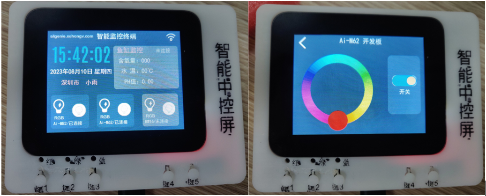
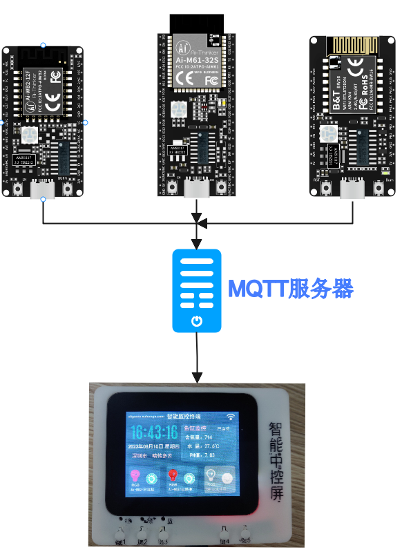
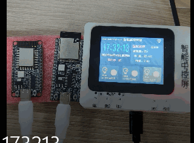

# 小安派智能监控终端

小安派智能监控终端是基于**小安派-SCP-2.4**中控板上实现的的一个监控设备。它支持时间显示,语音播报，远程信息监控，远程控制RGB,



## 一、配置WiFi

在`主页`屏幕往下滑，进入配置页面，点击`搜索`按钮开始扫描附近可用的WiFi名称。
在`PASS`输入框中输入响应的WiFi密码，随后点击`连接`按钮就可以连接WiFi。WiFi连接成功之后，智能监控终端会重启，已重新连接服务器。


WiFi 配置成功之后，会自动更新时间和连接远程MQTT服务器。

## 二、RGB控制

RGB 受控设备一共有3个，分别是Ai-WB2-12F-Kit 开发板、Ai-M61-32S-Kit开发板和BW16开发板，它们和智能监控终端之间使用MQTT服务器进行连接。因此，这三个只要在能连接网络的地方，智能中控屏就能控制它们。



### 1.独立控制

每个开发板的RGB都可以被智能监控终端进行独立的控制：在`主页`中，点击RGB 控制的开关，可以单独对开发板进行控制：



## 2.按键统一控制

**小安派-SCP-2.4** 设计了5个轻触按钮，它们接入的IO和对应控制的LED情况如下：

| 按钮 | IO | 对应的LED | 功能|
| :----: |:----: | :----: | :----: |
|按钮1 | GPIO_PIN_25| 红灯 | 红灯亮/灭 |
| 按钮2 | GPIO_PIN_26| 绿灯 | 绿灯亮/灭|
| 按钮3 | GPIO_PIN_28| 蓝灯 | 蓝灯亮/灭|
| 按钮4 | GPIO_PIN_29| 所有灯 | 所有灯亮|
| 按钮5 | GPIO_PIN_27| 所有灯 | 所有灯灭|

**控制详情：**

> - 按钮1控制板载红灯亮起时，同时会把所有RGB开发板的RGB的颜色设置为红色，板载红灯灭，及所有灯灭
> - 按钮2控制板载绿灯亮起时，同时会把所有RGB开发板的RGB的颜色设置为绿色，板载绿灯灭，及所有灯灭
> - 按钮3控制板载蓝灯亮起时，同时会把所有RGB开发板的RGB的颜色设置为蓝色，板载蓝灯灭，及所有灯灭
> - 按钮4控制板载所有灯亮，同时会把所有RGB开发板的RGB灯点亮，但不会设置RGB的颜色，RGB只会保持上次点亮的颜色
> - 按钮5控制板载所有灯灭，同时会把所有RGB开发板的RGB灯灭掉，但不会设置RGB的颜色
> - 按钮在按下时会有响应的语音播报想起

## 3.智能监控终端二次开发

### 1)修改连接的MQTT服务器

为了能够正常运行，需要在 `AiPi-SCP_SmartCtrl/components/UI/custom/custom.h` 中，修改以下MQTT 连接信息：

```c
#define MQTT_SERVER "your mqtt host"
#define MQTT_USER_NAME "mqtt user name"
#define MQTT_PASSWOLD "mqtt passworld"
```
### 2)编译

```c
make 
```

### 3)烧录
```c
make flash
```
### 4.Ai-M61-32S开发板RGB 工程二次开发

Ai-M61-32S开发板RGB 工程 是为了使用是快速体验RGB控制功能,因此，你可以需要准备一块Ai-M61-32S-Kit开发板或者**小安派-Eyes-DU**开发板。

### 1)修改连接的MQTT服务器

为了能够正常运行，需要在`AiPi-SCP_SmartCtrl/AiPi-M61-RGB/components/system_status/sys_status.h`中，修改以下MQTT 连接信息：
```
#define MQTT_SERVER "your mqtt host"
#define MQTT_USER_NAME "mqtt user name"
#define MQTT_PASSWOLD "mqtt passworld"
```
### 2)编译

```c
make 
```

### 3)烧录
```c
make flash
```