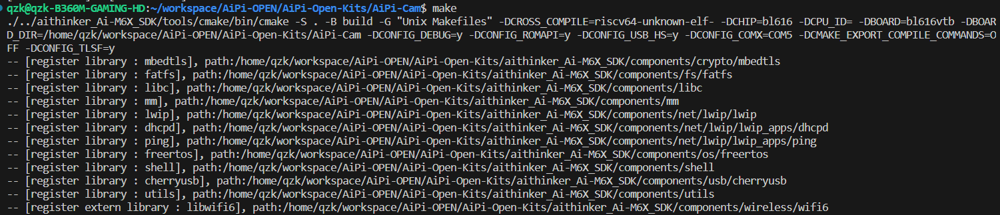
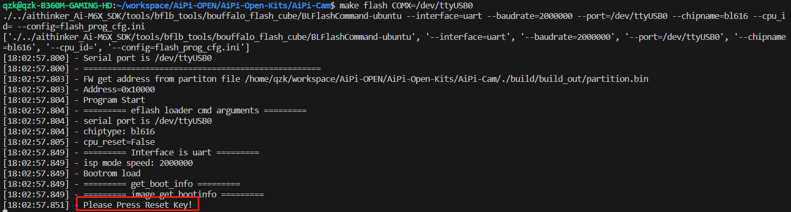
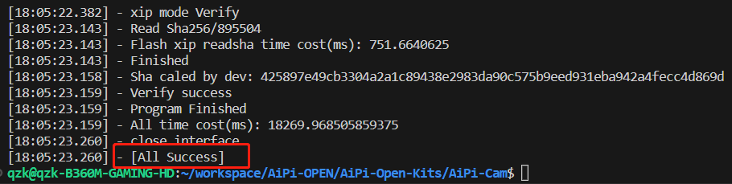

# 小安派-开源硬件

|开发板     | 概述 | 详细介绍|
| :----:    |:----: |:----: |
| AiPi-Eeys| 小安派-Eyes出厂固件源码| [点击查看](Ai-Pi_Eeys/README.md) |
| AiPi-Eeys_weather| 小安派-Eeys_天气站出厂固件源码| [点击查看](Ai-Pi_Eeys_weather/README.md) |
| AiPi-Audio| 小安派-Audio出厂固件源码| [点击查看](AiPi-Audio/README.md) |
| AiPi-Voice| 小安派-Voice出厂固件源码| [点击查看](AiPi-Voice/README.md) |
| AiPi-Cam| 小安派-Cam出厂固件源码| [点击查看](AiPi-Cam/README.md) |
| AiPi-DSL_Dashboard| 小安派桌面助手固件源码| [点击查看](AiPi-DSL_Dashboard/README.md) |
| AiPi-DSL_MusicPlay| 小安派-DSL_2.4出厂固件源码| [点击查看](AiPi-DSL_MusicPlay/README.md) |
| AiPi-DSL_Watch| 小安派-DSL_1.28出厂固件源码| [点击查看](AiPi-DSL_Watch/README.md) |
| AiPi-SCP-2.4| 小安派-SCP-2.4出厂固件源码| [点击查看](AiPi-SCP-2.4/README.md) |
| AiPi-SCP-4.3| 小安派-SCP-4.3出厂固件源码| [点击查看](AiPi-SCP-4.3/README.md) |
| AiPi-Eyes-DU| 小安派-Eyes-DU出厂固件源码| [点击查看](AiPi-Eyes-DU/README.md) |
| AiPi-SCP_SmartCtrl| 小安派智能监控终端 源码| [点击查看](AiPi-SCP_SmartCtrl/README.md) |
| AiPi-Knob| 小安派-Knob旋钮源码| [点击查看](AiPi-Knob/README.md) |
| AiPi-Remote| 小安派-Remote 源码| [点击查看](AiPi-Remote/README.md) |
| AiPi-Knob-ClipsTool| 小安派-AiPi-Knob-ClipsTool 剪辑助手源码| [点击查看](AiPi-Knob-ClipsTool/README.md) |
| AiPi-KVM| 小安派-KVM 三进一出切换器源码| [点击查看](AiPi-KVM/README.md) |

## 一、克隆Ai-Thinker仓库
在linux的终端下输入
```javascript
git clone https://github.com/Ai-Thinker-Open/AiPi-Open-Kits.git
```
将整个开源硬件的DEMO仓库克隆下来

## 二、拉取子模块
首先进入AiPi-Open-Kits目录下
```javascript
cd AiPi-Open-Kits
```
在该目录下输入以下两条指令初始化及拉取子模块
```javascript
git submodule init
git submodule update
```
进入aithinker_Ai-M6X_SDK，拉取SDK子模块以及设置路径
```javascript
. install.sh
. export.sh
```
## 三、编译和烧录

在AiPi-Open-Kits下可以看见各种小安派的Demo文件夹，使用cd命令进入到需要编译和烧录的Demo下

```javascript
cd 对应Demo目录文件夹
make                          //编译命令
make flash COMX=/dev/ttyUSB0  //烧录命令
```
***注意：启动烧录命令后会出现“Please Press Reset Key!”，需要在模组上按下RST键继续完成烧录***

## 示例——烧录AiPi-Cam

### 1.准备AiPi-Cam-D与USB转TTL，接线如下
|AiPi-Cam-D|连线  | USB转TTL     |
| :----: | :----: | :----:  |
| VCC    | ------ |3.3V     |
| RX     | ------ |TX       |
| TX     | ------ |RX       |
| GND    | ------ |GND      |

### 2.编译和烧录固件

#### （1）进入 AiPi-Cam 的目录文件夹


#### （2）输入 make 编译固件



#### （3）输入 make flash COMX=/dev/ttyUSB0

出现“Please Press Reset Key!"后按下RST



#### （4）出现“All Success”表示烧录成功

